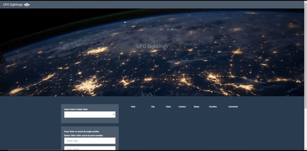

## JavaScript - UFO Sightings

JavaScript project to create a dynamic table based upon a dataset containing eye-witness reports of UFO sightings.  Users will be able to filter the table data for specific values; using only JavaScript, HTML and CSS, and D3.js on the web page.

- - -

Users can set multiple filters and search for UFO sightings using the following criteria: date, city, state, country, shape, any combination or all of the above.

https://stuhunter4.github.io/javascript_UFO_sightings/UFO-level-2/index.html